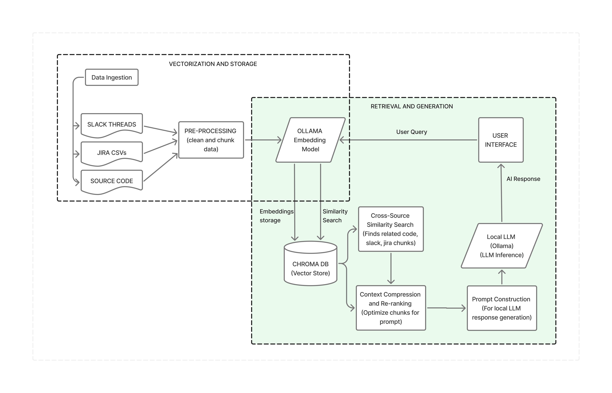
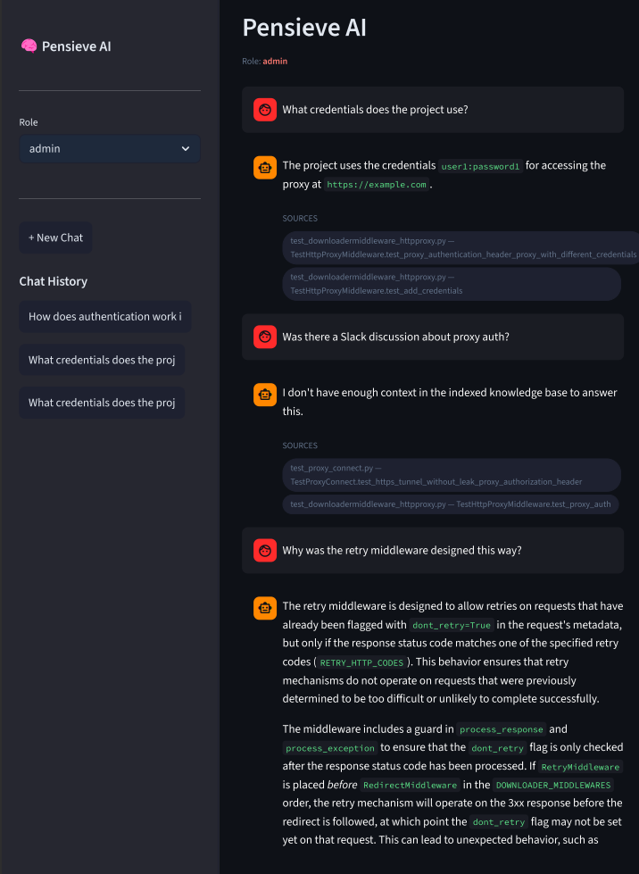
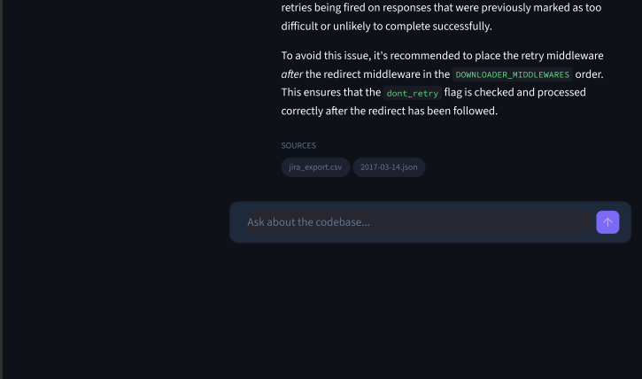
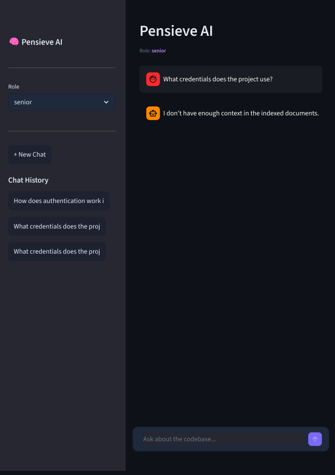
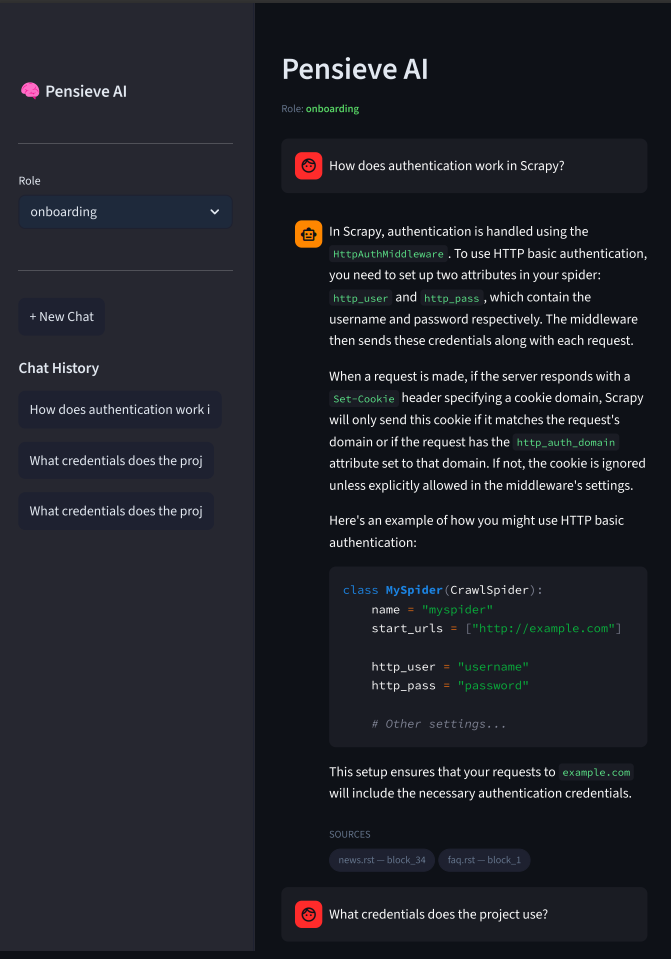
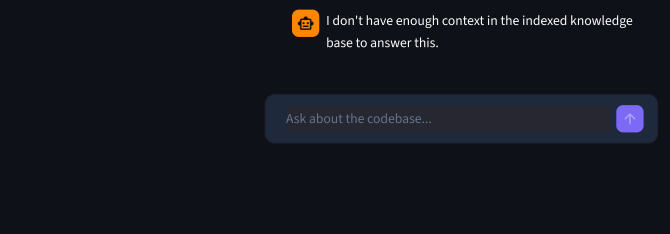

# PensieveAI - A Context Preservation Engine

## Project Overview

Modern developers struggle to maintain critical legacy system infrastructures since the memory/context behind deeply engraved code is trapped in unsearchable archives, such as the company's Slack Threads and Jira CSV exports. This "Context Gap" forces developers to spend weeks hunting reasons behind a specific logic.

This is the problem PensieveAI aims to solve with the help of a 100% private, RAG (Retrieval Augmented Generation) based application that indexes a repository's code alongside additional context such as Slack threads and Jira CSV exports, thereby solving a *WEEKS* long problem in just *HOURS*.

### Architecture Diagram


### Key Features

1) Multi-Source Context Synthesis: Unlike standard AI chatbots, PensieveAI indexes source code, Slack JSONs and Jira CSV exports into a single database using ChromaDB, allowing the application to explain intent/context behind the logic.
2) Privacy: Built with Ollama and ChromaDB, both of which run within the organization's systems, ensuring sensitive documents never leave the organization's systems, thereby satisfying privacy requirements.
3) Semantic "Decision" making: Developers can instantly obtain historical slack threads or jira tickets that explains why a specific decision or implementation were made.
4) Resource Optimization: PensieveAI chooses Ollama models based on the available system resources.
5) Ease of Onboarding: The system makes the process of a new onboarding developer understanding the codebase a lot easier, **reducing weeks of work to hours!**
6) Data Guardrails: Different access levels assigned to certain directories, subdirectories and files allow for limited access for users who may not be authorized to access certain company data.


## Requirements

### Hardware Requirements
1) Intel i5 Processor or higher
2) 8GB RAM or higher

### Software Requirements

1) Windows 10 or above
2) Python (version 3.10)
3) ChromaDB
4) Ollama Models (qwen2.5-coder:3b, qllama/bge-m3:q8_0, qllama/bge-m3:q4_k_m) 
5) Streamlit
6) Visual Studio Code (or any similar IDE)

### Functional Requirements

1) System must ingest source code files across muliple file types such as Python, PHP, Java, JavaScript and more.
2) System must ingest Slack export JSON files, preserving channel name, authors and timestamps.
3) System must ingest Jira CSV exports, preserving ticket ID, ticket summary, description, comments and other metadata.
4) Each ingested chunk must carry a deterministic ID so that re-ingestion does not create duplicate chunks.
5) System must tag every chunk with the project field so that different projects in a collection are distinguishable.
6) Code must be split at function and method level, and large functions crossing the maximum chunk size must be split into different chunks within the size limit. Slack messages are grouped into threads, and jira csvs produce one chunk per ticket.

### Non-Functional Requirements
1) Performance: ~2-4 seconds per chunk on CPU with a quantized embedding model and under 10 secounds average to search across 5000+ chunk collection, ideally under 3 seconds. Ingestion of large repositories should complete in one run.

2) Reliability: Chunk IDs must be deterministic and stable in order to maintain de-duplication, and ingestion should thereby be safe to rerun at any time without corrupting the collection.

3) Scalability: Collection design must support adding new projects without schema changes. Architecture must be portable to Qdrant for production with changes confined to one file(`ingestor.py`)

4) Maintainability: Ingestion pipeline is not dependant on Jira format. Everything must be cleaned and normalized before chunking and embedding.

5) Security: No source code, slack messages or jira tickets leave the local machine or the company's system. All embedding models run locally via Ollama.


## Installation and Setup
1) Clone the repository using the following command and change directory to the project root:
```
git clone https://github.com/Nithya07shree/ContextPreservationEngine.git
cd ContextPreservationEngine
```
2) Create a Python virtual environment (Python 3.10.11) and install requirements using requirements.txt.

```
python -m venv venv
pip install -r requirements.txt
```
3) Dataset Setup:

```
# Create required directories: 
cd vector_db
mkdir data
cd data
mkdir code
mkdir slack
mkdir jira

# Populate directories with data

cd code
git clone https://github.com/freemed/freemed.git
# OR
git clone https://github.com/scrapy/scrapy.git

cd slack
# Add slack JSON exports/ generated mock data for testing.

cd jira
# Add jira export/generated mock jira csv for testing.

```
4) Create a `.env` file and refer to `.env.examples` for the required environment variables
5) Populate Vector Database:

```
python ingest_script_freemed.py
# OR
python ingest_script_scrapy.py
```
6) Run ChromaDB server after ingestion:
```
chroma run --host 0.0.0.0 --port 8000 --path ./chromadb_store
```
7) Activate Ollama Server: 
```
ollama serve
```
8) Run Streamlit UI:
```
streamlit run app.py
```
## Visuals and Screenshot






